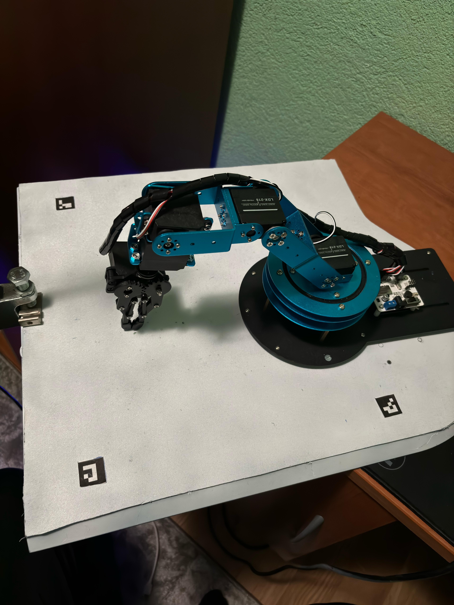
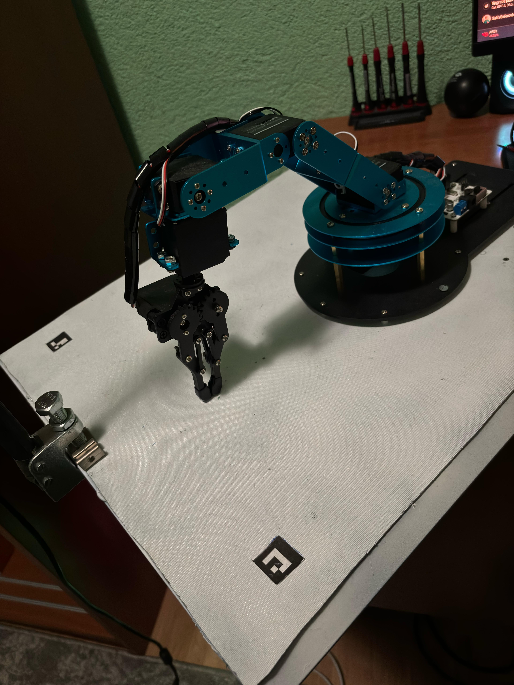
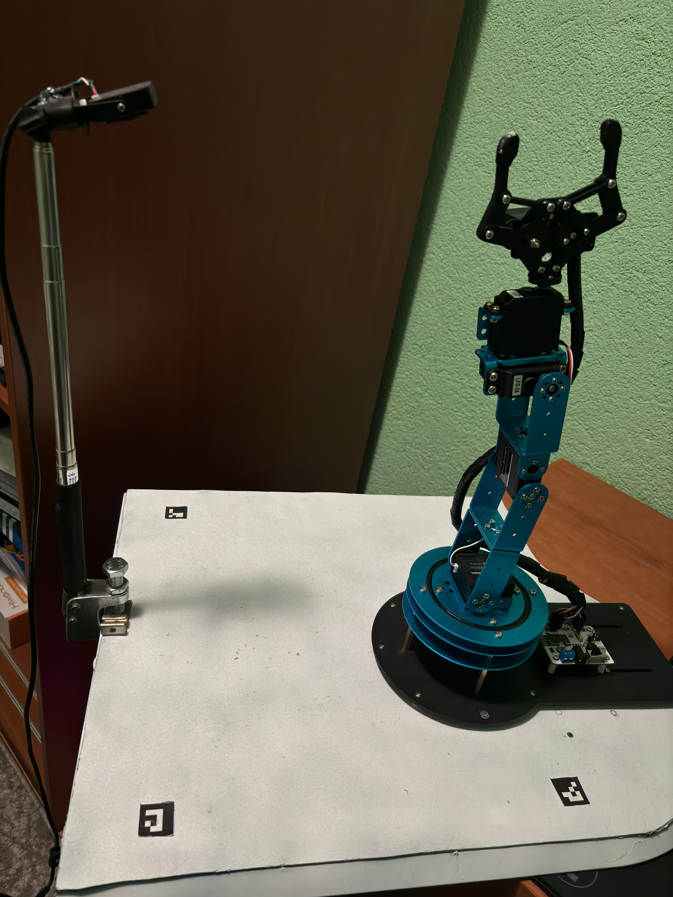

# AI-Arm

AI-Arm is an innovative robotic arm designed to facilitate human-robot collaboration using advanced computer vision and voice recognition technologies.
 
 

## Overview

In the rapidly evolving world of today, the need for intelligent and adaptable robotic solutions is greater than ever. AI-Arm addresses this need by integrating object recognition and physical manipulation capabilities, making it a versatile tool for various industries and everyday tasks.

## 🧐 Problem Statement

Despite advancements in robotics, many tasks still require human intervention, limiting efficiency and automation. Routine tasks are time-consuming, and existing robotic systems often lack user-friendly interfaces and accessibility, making them impractical for widespread use.

## 🎯 Objectives

1. **Enhance Automation and Efficiency**: Minimize the need for human intervention in routine tasks, improving overall productivity.
2. **Increase Accessibility**: Make robotic systems more accessible and easier to control through voice commands and intuitive interfaces.
3. **Expand Applicability**: Develop a versatile robotic platform that can be seamlessly integrated into various industries, including manufacturing, healthcare, and personal assistance.
4. **Improve Human-Robot Collaboration**: Design AI-Arm to work alongside humans, especially aiding those with disabilities or in industrial settings.

## 🧠 Technology Stack

### Artificial Intelligence & Computer Vision
- Object Detection: YOLOv8
- ArUco Marker Detection: Custom machine learning algorithms
- Voice Recognition: Deep neural networks (CNNs)

### Robotic Control
- 6-axis robotic arm with precise motor control
- Advanced kinematics:
  - Forward Kinematics
  - Inverse Kinematics
  - Denavit-Hartenberg (DH) parameters

### Development Tools
- Python
- PyTorch
- TensorFlow

## ⚙️ Technical Details

### Artificial Intelligence and Machine Learning
- **Object Detection**: Utilizes the YOLOv8 model for robust and accurate object recognition.
- **Voice Recognition**: Employs deep convolutional neural networks, to process and execute voice commands.
- **ArUco Marker Detection**: Implements machine learning algorithms to detect ArUco markers for orientation and position determination.

### Manipulation Capabilities
AI-Arm's manipulation system is based on precise kinematic calculations:
- **Forward Kinematics**: Uses Denavit-Hartenberg parameters to compute the gripper's position and orientation.
- **Inverse Kinematics**: Solves for the necessary motor angles to achieve a target position.

## 🚀 Applications (Use Cases)

### Industrial Automation
AI-Arm enhances production processes by performing tasks such as picking and placing objects, and assisting humans on assembly lines.

### Healthcare Assistance
In medical settings, AI-Arm can sort and deliver medical supplies, and assist in surgical procedures by handling instruments.

### Mechanical Work
AI-Arm can aid in mechanical tasks, such as handing over tools to auto mechanics based on voice commands.

### Assistance for People with Disabilities
AI-Arm helps individuals with disabilities by performing everyday tasks, thereby improving their quality of life.

## 📷 Images

<!-- Placeholder for images -->

 &emsp;&emsp;&emsp;

## ▶️ Video demonstration
<video width="640" height="480" controls autoplay loop>
  <source src="./media/video.mp4" type="video/mp4">
  Your browser does not support the video tag.
</video>